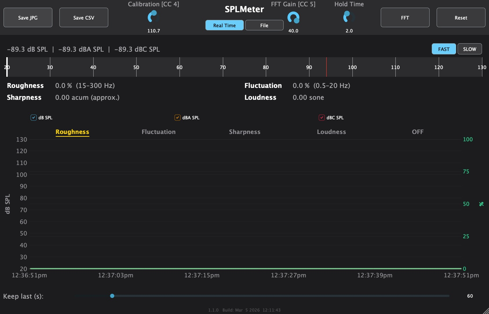

# SPLMeter

A professional Sound Pressure Level (SPL) meter built with JUCE, available as a macOS/Windows standalone app and as VST3 / AU plugin.



---

## Features

### SPL Measurement
- Broadband SPL in **dB**, **dB(A)**, and **dB(C)** — peak and RMS simultaneously
- IEC 61672-compliant time weighting: **FAST** (125 ms) and **SLOW** (1 s)
- Configurable **calibration offset** (80–140 dB, default 127 dB)
- Adjustable **peak hold time**

### Display
- Large horizontal bargraph meter (20–130 dB SPL scale)
- Numeric SPL readout with peak-hold indicator
- Time-series **log plot** with per-series visibility toggles (dB / dB(A) / dB(C))
- Selectable psychoacoustic overlay: Roughness, Fluctuation Strength, Sharpness, Loudness, or OFF
- Persistent real-time psychoacoustic readout (always visible, independent of log selector)

### 1/3-Octave FFT Overlay
- 31-band ISO 266 analysis (20 Hz – 20 kHz), toggled via the **FFT** button
- Bars drawn as a semi-transparent green overlay on the log plot
- **FFT Gain** rotary knob controls the input signal level into the FFT
- Unweighted (raw) signal — A/C weighting is not applied

### Psychoacoustic Metrics
Continuous real-time estimation of:

| Metric | Description |
|---|---|
| Roughness | Perceived roughness / beating (asper) |
| Sharpness | High-frequency spectral centroid (acum) |
| Fluctuation Strength | Slow amplitude modulation (vacil) |
| Loudness | Perceived loudness (sone) |

### Input Modes
- **Real Time** — live microphone / audio interface input, up to 8 channels
- **File** — load and analyse an audio file (WAV, AIFF, …)

### Export
- **Save JPG** — exports the current view as a JPEG image
- **Save CSV** — exports the full log (timestamps, all SPL values, all psychoacoustic metrics) as a CSV file

### MIDI Learn
Right-click any of the three knobs to assign or clear a MIDI CC mapping:
- **Calibration** — dB offset
- **FFT Gain** — FFT input gain
- **Hold Time** — peak hold duration

Assigned CC numbers are shown next to each knob label (e.g. `[CC 4]`).

---

## Controls

| Control | Description |
|---|---|
| FAST / SLOW | IEC 61672 time weighting |
| Real Time / File | Input source |
| Calibration | dB offset to convert full-scale to SPL (right-click for MIDI learn) |
| FFT Gain | Input gain for the 1/3-octave FFT overlay (right-click for MIDI learn) |
| Hold Time | Peak hold duration in seconds (right-click for MIDI learn) |
| FFT | Toggle 1/3-octave FFT overlay on/off |
| Log Duration | History length shown in the log plot |
| dB SPL / dBA SPL / dBC SPL | Visibility checkboxes for each SPL series in the log plot |
| Roughness / Fluctuation / Sharpness / Loudness / OFF | Select which psychoacoustic metric is overlaid in the log plot |
| Save JPG | Export current view as JPEG |
| Save CSV | Export full measurement log as CSV |
| Reset | Clear log and reset peak holds |

---

## Building

### macOS (Xcode)

Requires Xcode and the JUCE framework.

```bash
DEVELOPER_DIR=/Applications/Xcode.app/Contents/Developer \
  xcodebuild -project Builds/MacOSX/SPLMeter.xcodeproj \
             -scheme "SPLMeter - Standalone Plugin" \
             -configuration Release build
```

After building in an iCloud-synced directory, re-sign before launching:

```bash
xattr -cr Builds/MacOSX/build/Release/SPLMeter.app
codesign --force --sign - Builds/MacOSX/build/Release/SPLMeter.app
open Builds/MacOSX/build/Release/SPLMeter.app
```

### Windows (CMake)

ASIO support is included automatically — the build system fetches the ASIO SDK from the Steinberg VST3 SDK repository via CMake FetchContent.

```bash
cmake -B build -DCMAKE_BUILD_TYPE=Release
cmake --build build --config Release
```

### CI

GitHub Actions workflows build the standalone for macOS and Windows on every push.

---

## Requirements

- macOS 10.13+ (Apple Silicon native) or Windows 10+
- Audio input device for Real Time mode

---

## License

© Philipp Paul Klose. All rights reserved.
