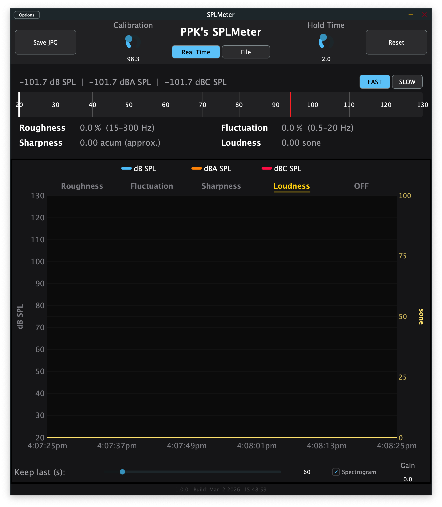

# SPLmeter

A professional Sound Pressure Level (SPL) meter built with JUCE, available as a macOS/Windows standalone app and as VST3 / AU plugin.



---

## Features

### SPL Measurement
- Broadband SPL in **dB**, **dB(A)**, and **dB(C)** — peak and RMS simultaneously
- IEC 61672-compliant time weighting: **FAST** (125 ms) and **SLOW** (1 s)
- Configurable **calibration offset** (80–140 dB, default 127 dB)
- Adjustable **peak hold time**

### Display
- Large horizontal bargraph meter (20–130 dB SPL scale)
- Numeric SPL readout with peak-hold indicator
- Time-series **log plot** — selectable metric: dB / dB(A) / dB(C) peak or RMS, Roughness, Sharpness, Fluctuation Strength, Loudness (Sone)

### Psychoacoustic Metrics
Continuous real-time estimation of:
| Metric | Description |
|---|---|
| Roughness | Perceived roughness / beating (asper) |
| Sharpness | High-frequency spectral centroid (acum) |
| Fluctuation Strength | Slow amplitude modulation (vacil) |
| Loudness | Perceived loudness (sone) |

### Input Modes
- **Real Time** — live microphone / audio interface input, up to 8 channels
- **File** — load and analyse an audio file (WAV, AIFF, …)

### Export
- **Save JPG** — exports the current view as a JPEG image
- **Reset** — clears log and peak holds

---

## Controls

| Control | Description |
|---|---|
| FAST / SLOW | IEC 61672 time weighting |
| Real Time / File | Input source |
| Calibration | dB offset to convert full-scale to SPL |
| Hold Time | Peak hold duration in seconds |
| Log Duration | History length shown in the log plot |
---

## Building

### macOS (Xcode)

Requires Xcode and the JUCE framework.

```bash
DEVELOPER_DIR=/Applications/Xcode.app/Contents/Developer \
  xcodebuild -project Builds/MacOSX/SPLMeter.xcodeproj \
             -scheme "SPLMeter - Standalone Plugin" \
             -configuration Release build
```

After building in an iCloud-synced directory, re-sign before launching:

```bash
xattr -cr Builds/MacOSX/build/Release/SPLMeter.app
codesign --force --sign - Builds/MacOSX/build/Release/SPLMeter.app
open Builds/MacOSX/build/Release/SPLMeter.app
```

### Windows (CMake)

```bash
cmake -B build -DCMAKE_BUILD_TYPE=Release
cmake --build build --config Release
```

### CI

GitHub Actions workflows build the standalone for macOS and Windows on every push.

---

## Requirements

- macOS 10.13+ (Apple Silicon native) or Windows 10+
- Audio input device for Real Time mode

---

## License

© Philipp Paul Klose. All rights reserved.
