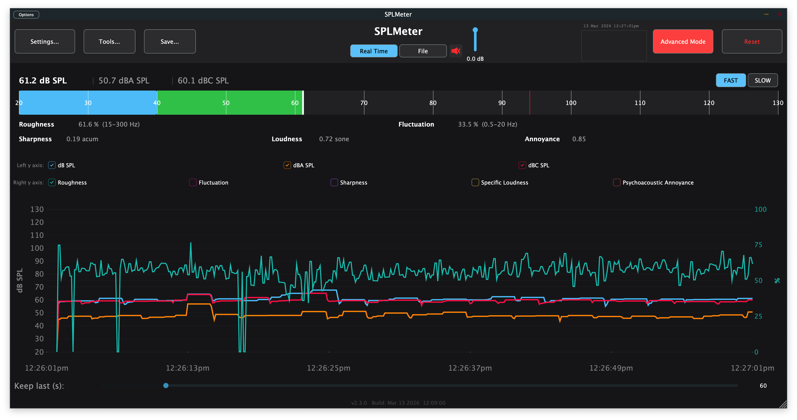

# SPLMeter

A professional Sound Pressure Level (SPL) meter built with JUCE, available as a macOS/Windows standalone app and as VST3 / AU plugin.



---

## Features

### SPL Measurement
- Broadband SPL in **dB**, **dB(A)**, and **dB(C)** — peak and RMS simultaneously
- IEC 61672-compliant time weighting: **FAST** (125 ms) and **SLOW** (1 s)
- Configurable **calibration offset** (80–140 dB, default 127 dB)
- Adjustable **peak hold time**
- Optional **20 Hz – 20 kHz bandpass** filter (8th-order Butterworth, 48 dB/oct)

### Display
- Large horizontal bargraph meter (20–130 dB SPL scale)
- Numeric SPL readout with peak-hold indicator
- **Basic / Advanced mode** toggle — Basic shows only the SPL meter; Advanced adds the full log plot and psychoacoustic overlay
- Time-series **log plot** with per-series visibility toggles (Left y-axis: dB / dB(A) / dB(C))
- Selectable psychoacoustic overlay on the right y-axis: Roughness, Fluctuation Strength, Sharpness, Specific Loudness, Psychoacoustic Annoyance

### SoundDetective
- ML-powered sound event detection; opened via the **Tools…** menu
- **Apple platforms (macOS / iOS):** uses Apple SoundAnalysis framework for on-device neural classification
- **All platforms:** optional user-supplied **TFLite model** (`.tflite`) loaded at runtime — supports any 1-D audio input model (e.g. YAMNet); auto-detects a matching `_labels.txt` file in the same directory; configurable model sample rate (default 16 kHz)
- Falls back to a heuristic amplitude-onset detector when no ML framework or model is available
- Configurable **minimum confidence threshold** (0.10 – 0.90)
- Scrollable **event log** — timestamp, label, confidence for each detected event; auto-trims to 500 events
- **Timeline markers** — detected events appear as labelled vertical markers on the log plot
- **Clear** button resets both the event log and the timeline markers simultaneously
- **Save Events CSV** export

### Spectrogram
- Opened via the **Tools…** menu; floating window with configurable controls
- **Frequency scale:** Log (default) or **Mel**
- Gain and time-resolution controls

### FFT Spectrum Analyser
- Toggled via the **FFT** button; displayed as a semi-transparent overlay on the log plot
- Unweighted (raw) signal — A/C weighting is not applied
- **Band resolution:** 1/1, 1/3, 1/6, 1/12, or 1/24 octave (up to ~240 bands)
- **Display modes:** Bars, Area fill, Bars + Peak hold markers
- **Window functions:** Hann, Hamming, Blackman, Flat-top, Rectangular
- **Overlap:** 0 %, 25 %, 50 %, 75 %
- **RTA +3 dB/oct mode** — applies a +3 dB/octave tilt so pink noise appears flat
- Frequency axis labels (20 Hz – 20 kHz) along the FFT x-axis

### Psychoacoustic Metrics
Continuous real-time estimation of:

| Metric | Description |
|---|---|
| Roughness | Perceived roughness / beating (15–300 Hz AM range) |
| Sharpness | High-frequency spectral centroid (acum, Zwicker/Aures model) |
| Fluctuation Strength | Slow amplitude modulation (0.5–20 Hz range) |
| Specific Loudness | Perceived loudness approximation (sone) |
| Psychoacoustic Annoyance | Combined annoyance index (Zwicker & Fastl 1999): N × (1 + √(w_S² + w_FR²)) |

### Input Modes
- **Real Time** — live microphone / audio interface input, up to **32 channels**
- **File** — load and analyse an audio file (WAV, AIFF, FLAC, MP3, OGG)
- **Monitor button** — speaker icon; output is muted by default, click to enable pass-through

### Export
Accessible via the **Save…** button (popup menu):
- **Save CSV** — exports the full measurement log (timestamps, all SPL values, all psychoacoustic metrics) as a CSV file
- **Save WAV** — saves the last *Keep Last* seconds of Input 01 and 02 as a stereo 24-bit WAV file
- **Save Screenshot** — exports the current view as a JPEG image
- **Save All** — saves CSV, WAV, and screenshot in one step into a chosen folder

### Analysis Tools
Accessible via the **Tools…** button (popup menu):
- **Spectrogram** — opens the spectrogram floating window (Log or Mel frequency scale)
- **SoundDetective** — ML-powered sound event detection (Apple SoundAnalysis on Apple platforms; optional TFLite model on all platforms; heuristic fallback)
- **ViSQOL** *(macOS / Windows when pre-built lib is present)* — perceptual audio quality analysis (MOS-LQO + per-band NSIM)
- **Correction Filter** — load a frequency-response correction curve (.txt / .csv: Hz + dB pairs); applied as a linear-phase FIR filter before metering (configured in Settings)
- **Graph Overlay** — load a reference curve and display it as a dashed blue line in the FFT view (configured in Settings)

### Title Bar Utilities
- **Live clock** — auto-updating date/time display (updates every second)
- **Note field** — three-line free-text field for session annotations

### Settings Panel
Opened via the **Settings** button. Organised into four sections:

| Section | Contents |
|---|---|
| **General** | Calibration fader, Hold Time fader, Light Mode, 94 dB Reference Line, 20–20k Bandpass, Full Screen |
| **FFT** | FFT enable toggle, FFT Gain fader, FFT Smooth fader, Band Resolution, Display Mode, Window Function, Overlap, Peak Hold, RTA +3 dB/oct |
| **Analysis** | Correction Filter (enable / load / clear), Graph Overlay (enable / load / clear) |
| **Input Channels** | Per-channel mute buttons for IN01 – IN32 |

### MIDI Learn
Right-click any of the three faders to assign or clear a MIDI CC mapping:
- **Calibration** — dB offset
- **FFT Gain** — FFT input gain
- **Hold Time** — peak hold duration

Assigned CC numbers are shown next to each fader label (e.g. `[CC 4]`).

---

## Controls

| Control | Description |
|---|---|
| Basic Mode / Advanced Mode | Toggle between compact meter-only view and full advanced view |
| FAST / SLOW | IEC 61672 time weighting |
| Real Time / File | Input source |
| Monitor (speaker icon) | Enables audio pass-through output; OFF by default |
| Settings… | Opens the settings panel |
| Calibration | dB offset to convert full-scale to SPL (right-click for MIDI learn) |
| Hold Time | Peak hold duration in seconds (right-click for MIDI learn) |
| FFT Gain | Input gain for the FFT overlay (right-click for MIDI learn) |
| FFT Smooth | Spectral smoothing factor (0 = off, 0.95 = heavy) |
| FFT | Toggle FFT spectrum overlay on/off |
| 20-20k BP | Enable 8th-order Butterworth bandpass filter |
| 94 dB Line | Draw a dashed reference line at 94 dB SPL in the log plot |
| Light Mode | Switch to light theme |
| Left y axis checkboxes | Visibility of dB SPL / dBA SPL / dBC SPL series |
| Right y axis checkboxes | Psychoacoustic overlay: Roughness / Fluctuation / Sharpness / Specific Loudness / Annoyance |
| Save… | Popup menu: Save CSV / Save WAV / Save Screenshot / Save All |
| Tools… | Popup menu: Spectrogram / SoundDetective / ViSQOL (macOS/Windows) |
| Reset | Clear log and reset peak holds |
| Clock | Live date/time (updates every second) |
| Note field | Free-text annotation field (3 lines) |

---

## Real-Time Audio Signal Flow

```
┌─────────────────────────────────────────────────────────────────────────────┐
│                    ppkSPLmeter v2.5 — Real-Time Audio Signal Flow           │
└─────────────────────────────────────────────────────────────────────────────┘

  ┌──────────────┐     ┌──────────────────────┐
  │  DAW / Host  │     │  File Transport       │
  │  Input Bus   │     │  AudioTransportSource │
  │  (≤32 ch)    │     │  (file playback mode) │
  └──────┬───────┘     └──────────┬───────────┘
         │                        │
         └──────────┬─────────────┘
                    │  source selection
                    ▼
          ┌──────────────────┐
          │  Channel Muting  │  (per-channel on/off, up to 32 ch)
          └────────┬─────────┘
                   │
                   ├──────────────────────────────────────────────────────────┐
                   │                                                           │
                   ▼                                                    WAV Capture
        ┌──────────────────────┐                                        (pre-EQ)│
        │  WAV Circular Buffer │ ◄── Ch0 + Ch1, pre-filter                     │
        │  (lock-free ring buf)│                                               │
        │  → Save WAV feature  │                                               │
        └──────────────────────┘                                               │
                   │                                                           │
                   ▼                                                           │
        ┌──────────────────────────────────────┐                              │
        │  Bandpass Filter (optional)           │                              │
        │  8th-order Butterworth 20Hz – 20kHz  │                              │
        │  4× cascaded biquad (HP + LP stages) │                              │
        │  per active channel                  │                              │
        └──────────────────┬───────────────────┘                              │
                           │                                                   │
                           ▼                                                   │
        ┌──────────────────────────────────────┐                              │
        │  FIR Correction Filter (optional)     │                              │
        │  4096-tap linear-phase               │                              │
        │  juce::dsp::Convolution              │                              │
        │  (inverted measured SPL curve)       │                              │
        └──────────────────┬───────────────────┘                              │
                           │                                                   │
                           ▼                                                   │
                 ┌─────────────────┐                                           │
                 │   Mono Mix      │  Σ(all active ch) / N                    │
                 └────────┬────────┘                                           │
                          │                                                    │
          ┌───────────────┼─────────────────────────────────────┐             │
          │               │                 │                   │             │
          ▼               ▼                 ▼                   ▼             │
  ┌──────────────┐ ┌─────────────┐  ┌───────────────┐  ┌────────────────┐   │
  │  A-Weighting │ │ C-Weighting │  │  FFT Circular │  │ Psychoacoustic │   │
  │  IIR filter  │ │  IIR filter │  │  Buffer       │  │  Estimators    │   │
  │  (IEC 61672) │ │  (IEC 61672)│  │  8192 samples │  │                │   │
  └──────┬───────┘ └──────┬──────┘  │  lock-free    │  │  • Roughness   │   │
         │                │         │  atomic write │  │    (AM 15-300Hz│   │
         │                │         └───────┬───────┘  │  • Sharpness   │   │
         │                │                 │           │    (Zwicker/   │   │
         │                │                 │           │     Aures 8-bd)│   │
         │                │                 │           │  • Fluctuation │   │
         │                │                 │           │    (0.5-20 Hz) │   │
         │                │                 │           └───────┬────────┘   │
         │                │                 │                   │             │
         └───────┬─────── ┘                 │                   │             │
                 │                          │                   │             │
                 ▼                          ▼                   ▼             │
        ┌─────────────────────┐    ┌────────────────┐  ┌───────────────────┐ │
        │  Peak Tracking      │    │  FFT spectrum  │  │  Psychoacoustic   │ │
        │  with Hold          │    │  → GUI display │  │  readouts         │ │
        │  (raw, A, C)        │    │  (30 Hz poll)  │  │  → GUI atomics    │ │
        │  configurable hold  │    └────────────────┘  └───────────────────┘ │
        └──────────┬──────────┘                                               │
                   │                                                           │
                   ▼                                                           │
        ┌──────────────────────────────────────┐                              │
        │  Exponential RMS Smoothing            │                              │
        │  IEC 61672 time weighting            │                              │
        │  FAST  τ = 125 ms                    │                              │
        │  SLOW  τ = 1000 ms                   │                              │
        │  (raw, A-weighted, C-weighted)       │                              │
        └──────────────────┬───────────────────┘                              │
                           │                                                   │
                           ▼                                                   │
        ┌──────────────────────────────────────┐                              │
        │  Atomic Readout Update (every 125ms)  │ ◄── also pushes LogEntry   │
        │  • SPL raw/A/C (fast+slow)           │     to deque               │
        │  • Peak raw/A/C                      │     (pruned to logDuration) │
        │  • Psychoacoustic values             │                              │
        └──────────────────┬───────────────────┘                              │
                           │                                                   │
                           ▼                                                   │
                  ┌─────────────────┐                                          │
                  │  Monitor Mute   │  buffer.clear() if monitor off           │
                  └────────┬────────┘                                          │
                           │                                                   │
                           ▼                                                   │
                  ┌─────────────────┐                                          │
                  │  DAW / Host     │                                          │
                  │  Output Bus     │                                          │
                  └─────────────────┘                                          │
                                                                               │
  ┌────────────────────────────────────────────────────────────────────────────┘
  │  GUI Timer (30 Hz)
  │  ┌──────────────────────────────────────────┐
  └─►│  timerCallback()                         │
     │  • reads atomics → MeterComponent        │
     │  • reads FFT ring buf → spectrum display │
     │  • updates Log / CSV export              │
     │  • MIDI CC learn / apply                 │
     └──────────────────────────────────────────┘
```

---

## Building

### macOS (Xcode)

Requires Xcode and the JUCE framework.

```bash
DEVELOPER_DIR=/Applications/Xcode.app/Contents/Developer \
  xcodebuild -project Builds/MacOSX/SPLMeter.xcodeproj \
             -scheme "SPLMeter - Standalone Plugin" \
             -configuration Release build
```

After building in an iCloud-synced directory, re-sign before launching:

```bash
xattr -cr Builds/MacOSX/build/Release/SPLMeter.app
codesign --force --sign - Builds/MacOSX/build/Release/SPLMeter.app
open Builds/MacOSX/build/Release/SPLMeter.app
```

### Windows (CMake)

```bash
cmake -B build -DCMAKE_BUILD_TYPE=Release
cmake --build build --config Release
```

**ASIO support** is enabled automatically — CMake downloads the Steinberg ASIO SDK 2.3.3 during configuration if it is not already present locally.

To use a local copy instead, place the unzipped SDK root at `Vendor/asiosdk/` inside the project root, or pass the path explicitly:

```bash
cmake -B build -DASIO_SDK_DIR="C:/path/to/asiosdk/common" -DCMAKE_BUILD_TYPE=Release
```

### CI

GitHub Actions workflows build the standalone for macOS and Windows on every push.

---

## Requirements

- macOS 10.13+ (Apple Silicon native) or Windows 10+
- Audio input device for Real Time mode

---

## Third-Party References

### Frameworks & SDKs

| Library | Version | License | URL |
|---|---|---|---|
| **JUCE** | 8.0.7 | ISC / GPL-3.0 | https://github.com/juce-framework/JUCE |
| **Steinberg VST3 SDK** (incl. ASIO SDK) | latest | Steinberg VST3 License | https://github.com/steinbergmedia/vst3sdk |

### Standards & Psychoacoustic Models

| Reference | Description |
|---|---|
| **IEC 61672-1:2013** | Electroacoustics — Sound level meters. Defines FAST (125 ms) and SLOW (1 s) time weighting and A/C frequency weighting curves. |
| **ISO 266:1997** | Preferred frequencies — defines the 31 standard 1/3-octave band centre frequencies (20 Hz – 20 kHz). |
| **Zwicker & Fastl, *Psychoacoustics: Facts and Models* (3rd ed., Springer, 2007)** | Theoretical basis for the Roughness, Sharpness, Fluctuation Strength, Specific Loudness, and Psychoacoustic Annoyance estimators. |

---

## Changelog

### v2.5.0
- **SoundDetective** — new ML sound event detection panel (via **Tools…** menu):
  - Apple platforms use the on-device **Apple SoundAnalysis** neural classifier
  - All platforms support loading a user-supplied **TFLite model** (`.tflite`) at runtime; auto-detects matching `_labels.txt`; configurable model sample rate
  - Heuristic amplitude-onset fallback when no ML framework or model is available
  - Configurable minimum confidence threshold; scrollable event log with timestamp, label, and confidence; auto-trims at 500 events
  - **Timeline markers** — events appear as vertical markers on the log plot
  - **Clear** button resets the event log and the timeline markers simultaneously
  - **Save Events CSV** export
- **TFLite cross-platform ML backend** — TensorFlow Lite 2.16.2 fetched and linked via CMake on all platforms; defines `SPLMETER_HAS_TFLITE`; model input window size adapted automatically from the tensor shape
- **ViSQOL cross-platform** — CMake now detects `Vendor/visqol/lib/visqol_ffi.lib` on Windows and enables ViSQOL there too; compile definition changed from hard-coded `JUCE_MAC` to `SPLMETER_HAS_VISQOL` (with `|| JUCE_MAC` fallback for Xcode builds)
- **Build fix** — AVFoundation and CoreMedia are now explicitly linked in the CMake build, fixing linker errors introduced by SoundDetective's Apple SoundAnalysis backend

### v2.4.0
- **Psychoacoustic Annoyance** — real-time Zwicker & Fastl annoyance index (PA) added as a momentary readout in the meter bar and as a selectable trace on the right y-axis of the log plot; included in CSV export
- **Specific Loudness** — renamed from "Loudness" throughout the UI and CSV output for clarity
- **Mel frequency scale** — spectrogram now offers a Log / Mel toggle; Mel scale compresses high frequencies and expands low frequencies for perceptually-uniform display
- **Save… menu** — Save CSV, Save WAV, Save Screenshot, and Save All grouped under a single popup button; Save All exports all three formats in one step to a chosen folder
- **Tools… menu** — Spectrogram and ViSQOL (macOS) grouped under a single popup button
- **ASIO level fix** — level readings with ASIO drivers (e.g. 32-channel interfaces) were up to 30 dB too low because the mono mix divided by total hardware channel count; fix counts only channels carrying signal
- **Settings… button** — renamed from "Settings" for standard macOS/Windows UI convention

### v2.3.0
- **Persistent user settings** — all settings (monitor level, FFT parameters, calibration, hold time, bandpass, 94 dB line, light mode, etc.) are saved to disk and restored on the next launch
- **Light mode persistence** — light/dark theme is remembered across launches
- **Correction filter auto-enable** — loading a correction curve automatically enables it
- **Correction file metadata parsing** — if the first line of a correction `.txt` contains `Sens Factor` and `SERNO:` (e.g. from a calibrated measurement microphone data sheet), the calibration offset is set to `94 + |Sens Factor|` and the serial number is filled into the notes field
- **Windows build provenance** — replaced expensive Azure Trusted Signing with free GitHub Artifact Attestations (SLSA); binaries are cryptographically linked to the CI workflow and verifiable with `gh attestation verify`
- **macOS microphone permission** — added `NSMicrophoneUsageDescription` to the app bundle so macOS shows the permission dialog on first launch
- **Light mode note field** — the notes text field now correctly follows the light/dark theme

### v2.2.2
- **Developer ID codesigning** — macOS builds are signed with a Developer ID Application certificate and notarized with the Apple Notary Service; Gatekeeper passes without warnings on all Macs
- **macOS distribution as DMG** — the Standalone app is packaged as a `.dmg` so the notarization ticket is preserved through download and the bundle structure is intact
- **Windows codesigning** — Azure Trusted Signing integrated into CI; `.exe` and `.vst3` are signed with a Microsoft-trusted certificate via the `azure/trusted-signing-action`
- **Linux support** — new CI job builds Standalone + VST3 on Ubuntu; required JUCE system dependencies (ALSA, X11, GL, Freetype, GTK3) resolved via `pkg_check_modules`
- **Persistent Basic / Advanced mode** — the app remembers the last used mode across launches; first launch defaults to Basic mode

### v2.1.0
- **ViSQOL integration** — perceptual audio quality analysis (MOS-LQO + per-band NSIM) available as a floating panel via the ViSQOL button (Advanced mode only)
- **Automatic audio conversion** — WAV files are automatically resampled, converted to 16-bit, and mixed to mono before ViSQOL analysis (GPL-compatible, JUCE-only pipeline); conversion details shown in the result panel
- **Default window width** increased to 1800 px
- **Real-time signal flow diagram** added to documentation

### v2.0.0
- **Basic / Advanced mode** — new mode toggle in the header; app starts in Basic mode (compact SPL meter only); Advanced mode adds the full log plot and psychoacoustic overlay
- **32-channel input** — channel count extended from 8 to 32; Settings panel shows 4 rows of 8 per-channel mute buttons (IN01 – IN32)
- **Save WAV** — records the last *Keep Last* seconds of IN01 + IN02 as a stereo 24-bit WAV file
- **Psychoacoustic axis checkboxes** — Roughness, Fluctuation, Sharpness, Loudness now have individual ToggleButton checkboxes on the right y-axis (radio-button behaviour); replaced the old click-on-name selector
- **Left / Right y-axis labels** — "Left y axis:" and "Right y axis:" section labels added above the respective checkbox rows
- **FFT frequency axis** — centre-frequency labels (20 Hz – 20 kHz) added along the FFT x-axis
- **Settings panel sections** — reorganised into four labelled sections: General, FFT, Analysis, Input Channels; thin separator lines between sections
- **Calibration, Hold Time, FFT Gain, FFT Smooth** — controls changed from rotary knobs to short vertical faders
- **Roughness colour** — distinct teal colour (was similar to dBA orange)
- **Live clock** — auto-updating date/time label in the title bar (updates every second)
- **Note field** — three-line free-text annotation field in the title bar
- **Reset button** — text colour changed to red (button background unchanged)
- **Window width** — default width increased to 1500 px; extended height 900 px

### v1.2.0
- **Settings panel** — floating settings window replaces individual toolbar controls
- **FFT overhaul** — band resolution up to 1/24 octave (~240 bands); display modes: Bars, Area, Bars+Peak; window functions: Hann, Hamming, Blackman, Flat-top, Rect; overlap: 0/25/50/75 %; FFT smoothing; peak hold toggle
- **RTA +3 dB/oct mode**
- **Light mode**
- **Monitor/mute button**
- **20-20k Bandpass filter**

### v1.1.0
- **Resizable window** (default 1400×900)
- **SPL series visibility toggles**
- **Persistent psychoacoustic readout**
- **Save CSV**
- **1/3-octave FFT overlay**
- **FFT Gain fader**
- **MIDI learn** for Calibration, FFT Gain, Hold Time
- **Windows ASIO support**

### v1.0.0
- Initial release
- Broadband SPL measurement in dB, dB(A), dB(C) — peak and RMS
- IEC 61672 FAST / SLOW time weighting
- Horizontal bargraph meter (20–130 dB SPL scale)
- Time-series log plot with configurable history length
- Real-time psychoacoustic metrics
- Real Time and File input modes
- Save JPG export
- Standalone, VST3, and AU formats

---

## License

© Philipp Paul Klose. All rights reserved.
